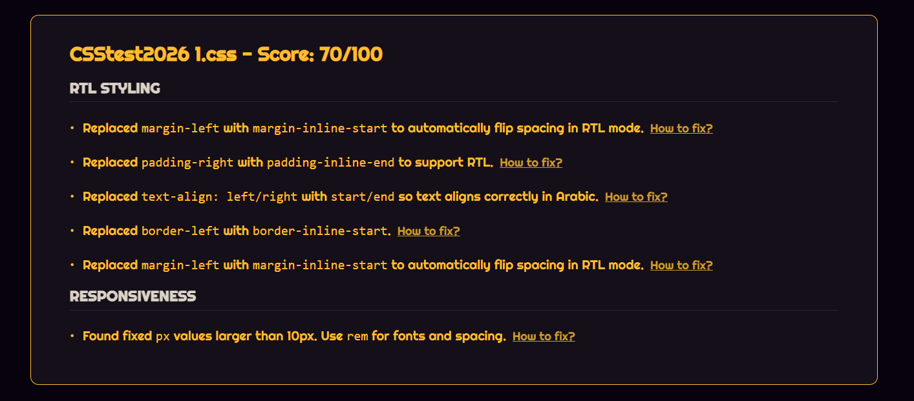
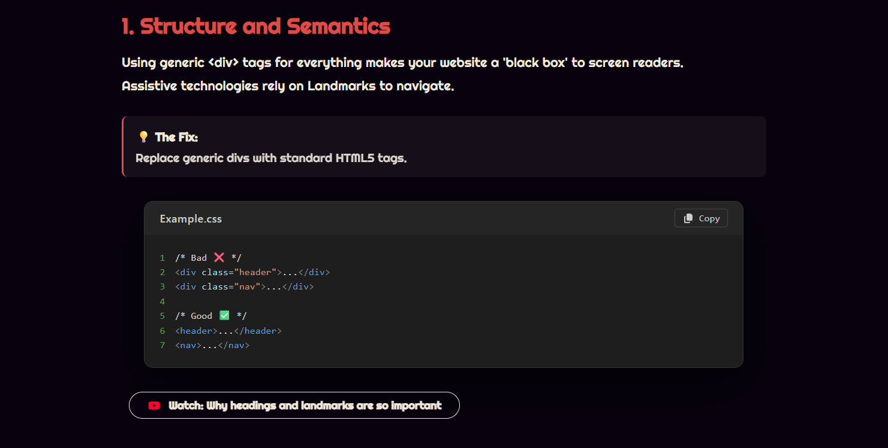

<a name="top"></a>
[](https://arabify-by-taim-kellizy.vercel.app)

<!-- Badges -->

[](https://opensource.org/licenses/MIT)
[](https://github.com/Taimkellizy/ArabifyByTaimKellizy)
[](https://react.dev/)
[](https://arabify-by-taim-kellizy.vercel.app)

**Arabify (عَرِّب)** is an RTL-first static analysis tool and toolkit for HTML/CSS/JS. It scans direction-sensitive code (physical left/right usage, layout assumptions) and scores how ready a page is for RTL languages. The focus is RTL correctness first; optional checks for accessibility and AR-SEO are included as secondary signals. All analysis runs client-side and is fully rule-based — no AI, no guesswork.

[](https://www.linkedin.com/in/taimkellizy/)

---

## Table of Contents

- [About](#-about)
- [What's New](#-whats-new)
- [Scoring Model](#-scoring-model)
- [How it works](#-how-to-works)
- [Limitations](#-limitations)
- [Online Demo](#-online-demo)
- [How to Build](#-how-to-build)
- [Project Structure](#-project-structure)
- [License](#-license)
- [Contacts](#-contacts)

## 🚀 About

**Arabify** is designed to help developers ensure their web pages are fully optimized for Arabic users. It goes beyond simple RTL checks by analyzing deep architectural patterns in your HTML and CSS.

### 🛠️ Tech stack

- **Frontend**: Plain React with components from [**React Bits**](https://reactbits.dev), [**GSAP**](https://gsap.com), and icons from [**FontAwesome**](https://fontawesome.com/).
- **CSS Processing**: [**PostCSS**](https://postcss.org/) for robust parsing and analysis of CSS files.
- **Syntax Highlighting**: [**react-syntax-highlighter**](https://github.com/react-syntax-highlighter/react-syntax-highlighter) (Prism) for code previews.
- **No server required**: Runs entirely in the browser (MVP).

## ✨ What's New

### Version 0.7.0 (Major Release)

> [!TIP]
> This release introduces a **Unified Upload Experience**, **Refined UI**, **Code Injection Intelligence**, and **CSS Modernization**.

#### ⚡ New Features & Improvements

- **Intelligent Context-Aware Analysis**:
  - **Zero False Positives**: Differentiates between CSS style objects and generic data objects using context heuristics (e.g., inside `style={{}}` props, or variables named `*Style`).
  - **Strict vs. Ambiguous**: "Strict" physical properties (e.g., `marginLeft`) are always flagged. "Ambiguous" properties (e.g., `left`, `right`) are only flagged when used in a style context.
  - **Class Name Detection**: scores against hardcoded directional class names like `text-left`, `float-right`.
- **TypeScript Support**:
  - **Type-Safe Parsing**: Full support for `.ts` and `.tsx` files.
  - **Heuristic Unwrapping**: Handles `as const` assertions (e.g., `textAlign: 'left' as const`) and other TS specific syntax without choking.
- **Enhanced Auto-Fixer**:
  - **100% Border Coverage**: Now fully supports and fixes `border-left-width`, `border-left-style`, `border-left-color` (and their right counterparts) to their logical equivalents.
  - **Smarter Replacements**: Only applies fixes where it's confident, reducing the risk of breaking non-style code.
- **Unified Upload & Drag-and-Drop**:
  - **Unified Flow**: Removed dropdowns. Single, seamless drop zone for mixed files and folders.
  - **Recursive Scanning**: Drag nested folders and files simultaneously; deep scans verify all content.
  - **Accumulation**: Add files incrementally without clearing the previous selection.
- **Smart React Injection Engine**:
  - **Smart Placement**: Intelligently places the `LanguageToggle` inside list items (`<li>`) if a list is detected within the `<nav>`.
  - **Header Fallback**: If no `<nav>` is found, strictly injects into `<header>` to ensure accessibility.
  - **Dynamic Indentation**: Automatically detects and respects existing 2-space or 4-space indentation.
- **Reporting & Scoring**:
  - **JSON Reports**: Download detailed analysis reports with standardized English keys, regardless of UI language.
  - **Weighted Scoring**: "Main files" (App.js, index.html) now carry 2x weight to prioritize core architectural patterns.
- **Multi-Language & CSS Fixes**:
  - **JSX Inline Style Fixes**: Transforms inline styles in JSX to logical properties.
  - **Auto-Fix Float**: Automatically converts `float: left` to `float: inline-start`.
- **Codebase & Architecture**:
  - **Modular Logic**: Extracted RTL constants to `constants.js` for better maintainability and to prevent self-scanning issues.
  - **Modular A11Y Logic**: Extracted accessibility checks into a dedicated `analyzeA11Y` service for better maintainability and testability.
  - **Robust Testing**: Expanded test suite with context-specific tests and integration checks.



## 📖 Scoring Model

We use a weighted scoring system to evaluate your page:

### HTML Checks

- **Semantic Tags**: `header`, `nav`, `footer` (-20 points each, max -60)
- **SEO**: Meta tags (-5 points each, max -25)
- **Accessibility**: `alt` attribute (-10 points once)
- **Language**: `lang`, `dir` attributes (-5 points each once)

### CSS Checks

- **RTL Logic**: Checks for physical properties that should be logical:
  - Margins/Paddings (left/right → inline-start/end)
  - Borders (left/right → inline-start/end)
  - Text Align (left/right → start/end)
  - Border Radius (-5 points for every match)
  - Positioning (left/right → inset-inline-start/end)
- **Units**: Any fixed units like `px` (-5 points once)

> **Note:** There is no negative score (min 0). Auto-fix is available for CSS properties but not for Units.

## 📐 How it works

1.  **Upload/Paste**: User uploads HTML/CSS files or pastes code.
2.  **Parse**: App parses HTML with `DOMParser` and CSS with `PostCSS`.
3.  **Analyze & Fix**: App suggests fixes and offers naive auto-fixes (e.g., converting `margin-left` → `margin-inline-start`, exploding `border-radius`).
4.  **Learn**: Results link to educational blog sections.



## ⭕ Limitations

- **Images**: Does not analyze image content.
- **Heuristics**: Checks are conservative. Always double-check suggested auto-fixes.

## 🌐 Online Demo

Try it out here: [**arabify-by-taim-kellizy.vercel.app**](https://arabify-by-taim-kellizy.vercel.app)

## 📝 How to Build

### Prerequisites

- **Node.js** installed.

### Installation

1.  **Clone the repository**

    ```bash
    git clone https://github.com/Taimkellizy/Arabify-rtl.git
    cd arabify-rtl
    ```

2.  **Install dependencies**

    ```bash
    npm install
    ```

3.  **Start the development server**

    ```bash
    npm start
    ```

4.  **Running Tests**
    ```bash
    npm test
    ```

## 📂 Project Structure

```text
src/
├── App.js              # Main application logic & Router
├── App.css             # Global Styles & Font Definitions
├── content.js          # Dictionary for English/Arabic text
├── components/         # Reusable UI components (Header, Footer, SplitText, etc.)
├── contexts/           # Global Contexts
│   └── LanguageContext.js # Language State Management
├── pages/              # Route pages
│   ├── Home.js         # Main landing & tool page
│   └── Blog.js         # Educational content page
├── services/           # Core Analysis Logic
│   ├── analyzeA11Y.js  # Accessibility & Best Practices checks
│   ├── analyzeCSS.js   # CSS Parser & RTL Logic
│   ├── analyzeHTML.js  # HTML Structure & Meta checks
│   └── analyzeJSX.js   # React/JSX code analysis
└── utils/              # Helper Utilities
    ├── fileScanner.js  # File processing logic
    ├── scoreCalculator.js # Weighted scoring algorithm
    └── ...
```

## 🤝 Feedback and Contributions

Your input is crucial for our continuous improvement. Whether you have feedback on features, bugs, or suggestions, we're eager to hear from you.

## 📃 License

Distributed under the **MIT License**.

## 🗨️ Contacts

- **Email**: [taimkellizy@gmail.com](mailto:taimkellizy@gmail.com)
- **LinkedIn**: [Taim Kellizy](https://www.linkedin.com/in/taimkellizy/)

[Back to top](#top)
